# ChronoNewsScheduler

ChronoNewsScheduler is a robust background job processor built with Go. Designed as an integral part of the **[ChronoNewsAPI](https://github.com/ScrKiddie/ChronoNewsAPI)** project, it handles resource-intensive tasks asynchronously to maintain a fast and responsive API.

## Features

- **Efficient Image Compression**: Automatically transcodes and compresses uploaded images into the modern, high-performance WebP format, significantly reducing file sizes while maintaining visual quality.
- **Hybrid Storage Adapter**: Seamlessly switch between **Local Disk** storage for development and **S3-Compatible Cloud Storage** (like Cloudflare R2 or AWS S3) for production via simple configuration.
- **Concurrent Worker Pool**: Uses a configurable worker pool to process multiple images in parallel, optimizing CPU and Network usage without blocking the main application.
- **Resilient Job Processing**: Guarantees task reliability with an automatic retry mechanism for transient failures and a **Dead Letter Queue (DLQ)** for permanently failed jobs.
- **Idempotent Architecture**: Designed to handle interruptions, crashes, or race conditions safely. Operations are atomic, ensuring data consistency even during `cron` overlaps.
- **Safe Deletion Strategy**: Original files are only queued for deletion *after* the compressed version is successfully stored and the database is updated.
- **Maintenance Services**: Includes services for **Orphaned File Cleanup** (disk optimization) and a **Stuck Task Janitor** (recovering crashed jobs).
- **Fully Configurable**: Fine-tune every aspect of the application's behavior—from storage backends to worker counts—through environment variables.

## Architecture Diagram

```mermaid
graph TD
    subgraph "Core Infrastructure"
        DB[(Database: PostgreSQL)]
        Storage[(Storage: Local / S3)]
        DeletionQueue[(Deletion Queue Table)]
    end
    
    MainApp[Main ChronoNews API]

    subgraph "ChronoNewsScheduler (Triggered by Cron)"
        direction TB
        subgraph "Services (selected by APP_MODE)"
            CompressionService(Compression Service)
            JanitorService(Janitor Service)
            CleanupService(Orphaned File Cleanup)
            DeletionService(Source File Deletion)
        end
    end

    %% Interactions
    MainApp -- "Uploads raw file & creates record" --> DB
    MainApp -- "Writes initial file" --> Storage

    CompressionService -- "1. Finds 'pending' tasks" --> DB
    CompressionService -- "2. Streams source image" --> Storage
    CompressionService -- "3. Buffers & Uploads WebP" --> Storage
    CompressionService -- "4. Updates status & filename" --> DB
    CompressionService -- "5. Queues original file for delete" --> DeletionQueue

    JanitorService -- "1. Finds stuck 'processing' tasks" --> DB
    JanitorService -- "2. Resets status to 'pending'" --> DB

    CleanupService -- "1. Finds old & unused file records" --> DB
    CleanupService -- "2. Deletes physical file" --> Storage
    CleanupService -- "3. Deletes file record" --> DB

    DeletionService -- "1. Reads tasks from queue" --> DeletionQueue
    DeletionService -- "2. Deletes original file" --> Storage
    DeletionService -- "3. Deletes task from queue" --> DeletionQueue
```

## Dependencies

The only required system dependency is the `libvips` library. The Go bindings included in this repository were pre-generated using the [vipsgen](https://github.com/cshum/vipsgen) tool and are specifically tailored for **`libvips` version `8.12.1`**. This ensures the project works out-of-the-box if you have the same version installed. If you need to use a different version of `libvips`, simply install your version and run `go mod tidy`.

## Configuration

All application settings are managed via an `.env` file. Create one based on the `.env.example` file.

### Scheduling Model

The application uses a centralized scheduling model using `cron`. It is designed to allow **overlapping executions** for maximum throughput. If a previous job is still running when the next schedule triggers, a new instance starts safely. Concurrency safety is guaranteed via **Database Row Locking (`SKIP LOCKED`)**, ensuring no two instances ever process the same file simultaneously.

-----

### Environment Variables

#### **1. Database Configuration**

| Variable | Description | Example Value |
|---|---|---|
| `DB_HOST` | Hostname or IP address of the PostgreSQL server. | `localhost` |
| `DB_USER` | Username for the database connection. | `postgres` |
| `DB_PASSWORD` | Password for the database user. | `secret` |
| `DB_NAME` | The name of the database to use. | `chrononews_db` |
| `DB_PORT` | The port on which the database server is running. | `5432` |
| `DB_SSL_MODE` | SSL connection mode (`disable`, `require`, `verify-ca`). | `disable` |

#### **2. General Application**

| Variable | Description | Example Value |
|---|---|---|
| `LOG_LEVEL` | Logging verbosity (`debug`, `info`, `warn`, `error`). | `info` |
| `APP_SCHEDULE` | The cron schedule expression. | `'*/1 * * * *'` |
| `APP_MODE` | Determines which service to run. Options: `all`, `compression`, `cleanup`, `janitor`, `deletion`. | `all` |

#### **3. Storage & Directories (New)**

| Variable | Description | Example Value |
|---|---|---|
| `STORAGE_MODE` | Storage backend to use. Options: `local` or `s3`. | `s3` |
| `DIR_ATTACHMENT` | Folder/Prefix for post attachments. | `post_picture` |
| `DIR_PROFILE` | Folder/Prefix for user profiles. | `profile_picture` |
| `DIR_THUMBNAIL` | Folder/Prefix for thumbnails. | `thumbnail` |

#### **4. S3 / Cloudflare R2 Configuration**
*Required if `STORAGE_MODE=s3`*

| Variable | Description | Example Value |
|---|---|---|
| `S3_BUCKET` | The name of your S3 bucket. | `my-bucket` |
| `S3_REGION` | AWS Region (use `auto` for Cloudflare R2). | `auto` |
| `S3_ACCESS_KEY` | Access Key ID. | `your_access_key` |
| `S3_SECRET_KEY` | Secret Access Key. | `your_secret_key` |
| `S3_ENDPOINT` | Custom endpoint URL (for R2/MinIO). **Do not include bucket name**. | `https://<account>.r2.cloudflarestorage.com` |

#### **5. Compression Engine**

| Variable | Description | Example Value |
|---|---|---|
| `COMPRESSION_IS_TEST_MODE` | If `true`, runs simulation only (no DB update, no file save). | `false` |
| `COMPRESSION_IS_CONCURRENT` | Use worker pool (`true`) or sequential processing (`false`). | `true` |
| `COMPRESSION_NUM_WORKERS` | Number of concurrent workers (CPU/IO combined). | `4` |
| `COMPRESSION_BATCH_SIZE` | Number of images to fetch in a single database transaction. | `50` |
| `COMPRESSION_MAX_RETRIES` | Max retries before sending task to DLQ. | `3` |
| `COMPRESSION_WEBP_QUALITY` | Compression quality for WebP images (1-100). | `75` |
| `COMPRESSION_MAX_WIDTH` | Maximum width for resized images. | `1920` |
| `COMPRESSION_MAX_HEIGHT` | Maximum height for resized images. | `1920` |

#### **6. Maintenance Services**

| Variable | Description | Example Value |
|---|---|---|
| `JANITOR_STUCK_THRESHOLD` | Time after which a 'processing' task is reset (e.g., `15m`). | `15m` |
| `CLEANUP_THRESHOLD` | Minimum age of an unused file before deletion (e.g., `720h`). | `720h` |
| `CLEANUP_BATCH_SIZE` | Batch size for orphaned file cleanup. | `100` |
| `DELETION_QUEUE_BATCH_SIZE`| Batch size for source file deletion. | `100` |
| `DELETION_QUEUE_MAX_RETRIES`| Max retries for file deletion failure. | `5` |