# ChronoNewsScheduler

ChronoNewsScheduler is a robust background job processor built with Go. Designed as an integral part of the **[ChronoNewsAPI](https://github.com/ScrKiddie/ChronoNewsAPI)** project, it handles resource-intensive tasks asynchronously to maintain a fast and responsive API.

## Features

- **Efficient Image Compression**: Automatically transcodes and compresses uploaded images into the modern, high-performance WebP format, significantly reducing file sizes while maintaining quality.
- **Dual Processing Modes**: Offers a choice between a high-throughput **Concurrent Pipeline** that separates I/O and CPU-bound work for maximum efficiency, and a simple **Sequential Mode** for lighter workloads.
- **Resilient Job Processing**: Guarantees task reliability with an automatic retry mechanism for transient failures and a **Dead Letter Queue (DLQ)** for permanently failed jobs, ensuring no task is ever lost.
- **Idempotent Deletion Queue**: Reliably cleans up original source files after compression using a persistent database queue. This guarantees file deletion even across application restarts.
- **Orphaned File Cleanup**: Includes a dedicated service to automatically find and remove old, unused file assets from storage, keeping disk usage optimized.
- **Stuck Task Janitor**: Proactively prevents jobs from getting stuck indefinitely. A janitor service automatically identifies and requeues tasks that have been in a `processing` state for too long.
- **Fully Configurable**: Fine-tune every aspect of the application's behavior—from worker counts to retry policies—through environment variables.
- **Structured Logging**: Emits clear, structured logs for straightforward monitoring, parsing, and integration with modern observability platforms.

## Architecture Diagram

```mermaid
graph TD
    subgraph "Core Infrastructure"
        DB[(Database: file, ...)]
        FS[(Filesystem)]
        DeletionQueue[(Deletion Queue Table)]
    end
    
    MainApp[Main ChronoNews API]

    subgraph "ChronoNewsScheduler (Triggered by Cron)"
        subgraph "Services (selected by APP_MODE)"
            direction TB
            CompressionService(Compression Service)
            JanitorService(Janitor Service)
            CleanupService(Orphaned File Cleanup)
            DeletionService(Source File Deletion)
        end
    end

    %% Interactions
    MainApp -- "Updates post/file relationship" --> DB

    CompressionService -- "1. Finds 'pending' tasks" --> DB
    CompressionService -- "2. Reads source image" --> FS
    CompressionService -- "3. Writes compressed image" --> FS
    CompressionService -- "4. Updates status to 'compressed'" --> DB
    CompressionService -- "5. Adds source file path to queue" --> DeletionQueue

    JanitorService -- "1. Finds stuck 'processing' tasks" --> DB
    JanitorService -- "2. Resets status to 'pending'" --> DB

    CleanupService -- "1. Finds old & unused file records" --> DB
    CleanupService -- "2. Deletes unused file" --> FS
    CleanupService -- "3. Deletes file record" --> DB

    DeletionService -- "1. Reads tasks from queue" --> DeletionQueue
    DeletionService -- "2. Deletes source file (.jpg)" --> FS
    DeletionService -- "3. Deletes task from queue" --> DeletionQueue
```

## Dependencies

The only required system dependency is the `libvips` library. The Go bindings included in this repository were pre-generated using the [vipsgen](https://github.com/cshum/vipsgen) tool and are specifically tailored for **`libvips` version `8.12.1`**. This ensures the project works out-of-the-box if you have the same version installed. If you need to use a different version of `libvips` or wish to customize the bindings, you can regenerate them yourself by running `vipsgen`. Otherwise, simply install the matching `libvips` version and run `go mod tidy`.

## Configuration

All application settings are managed via an `.env` file. Create one based on the `.env.example` file.

### Scheduling Model

The application uses a centralized scheduling model. You define a **single master schedule** with `APP_SCHEDULE`. When this schedule is triggered, the `APP_MODE` variable determines **which service (or services) will be executed**.

-----

### Environment Variables

#### **General & Database**

| Variable | Description | Example Value |
|---|---|---|
| `DB_HOST` | Hostname or IP address of the PostgreSQL server. | `localhost` |
| `DB_USER` | Username for the database connection. | `postgres` |
| `DB_PASSWORD` | Password for the database user. | `secret` |
| `DB_NAME` | The name of the database to use. | `chrononews_db` |
| `DB_PORT` | The port on which the database server is running. | `5432` |
| `LOG_LEVEL` | Logging verbosity (`debug`, `info`, `warn`, `error`). | `info` |

#### **Main Application Scheduler**

| Variable | Description | Example Value |
|---|---|---|
| `APP_SCHEDULE` | The single cron schedule that triggers the application. | `'*/5 * * * *'` |
| `APP_MODE` | Determines which service to run. Options: `all`, `compression`, `cleanup`, `janitor`, `deletion`. | `all` |

#### **Compression Service**

| Variable | Description | Example Value |
|---|---|---|
| `COMPRESSION_SOURCE_DIR` | The source directory to read original images from. | `./images/source` |
| `COMPRESSION_DEST_DIR` | The destination directory to write compressed images to. | `./images/compressed` |
| `COMPRESSION_IS_TEST_MODE` | If `true`, database updates are skipped. Useful for testing. | `false` |
| `COMPRESSION_MAX_RETRIES` | Max number of retries before a task is sent to the DLQ. | `3` |
| `COMPRESSION_IS_CONCURRENT` | Use the high-performance concurrent pipeline (`true`) or sequential mode (`false`). | `true` |
| `COMPRESSION_BATCH_SIZE` | Number of images to fetch and process in a single run. | `50` |
| `COMPRESSION_NUM_IO_WORKERS` | Number of workers for I/O tasks (read/write files) in concurrent mode. | `8` |
| `COMPRESSION_NUM_CPU_WORKERS`| Number of workers for image processing (CPU-bound) in concurrent mode. | `4` |
| `COMPRESSION_WEBP_QUALITY` | Compression quality for WebP images (1-100). | `75` |
| `COMPRESSION_MAX_WIDTH` | Maximum width for resized images. | `1920` |
| `COMPRESSION_MAX_HEIGHT` | Maximum height for resized images. | `1080` |

#### **Janitor Service (Stuck Task Cleaner)**

| Variable | Description | Example Value |
|---|---|---|
| `JANITOR_STUCK_THRESHOLD` | Duration after which a task in 'processing' state is considered stuck (e.g., `15m`, `1h`). | `30m` |

#### **Cleanup Service (Orphaned File Cleaner)**

| Variable | Description | Example Value |
|---|---|---|
| `CLEANUP_THRESHOLD` | Minimum age of an unused file before it can be deleted (e.g., `720h`). | `720h` |
| `CLEANUP_BATCH_SIZE` | Number of files to delete in a single run. | `100` |

#### **Deletion Queue Service**

| Variable | Description | Example Value |
|---|---|---|
| `DELETION_QUEUE_BATCH_SIZE`| Number of source files to delete from the queue in a single run. | `100` |
| `DELETION_QUEUE_MAX_RETRIES`| Max number of retries for a failed file deletion. | `5` |